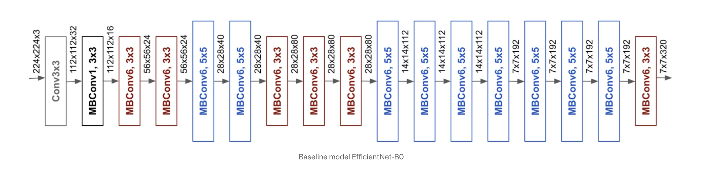

# Computer vision

Le but est de voir l'influence de la diffusion anisotrope sur l'apprentissage d'un réseau 
EfficientNet-B0 avec des images echographiques de poumons qui contiennet des anomalies (B-lines)

# Étapes

- Théorie sur EfficientNet-B0
- Théorie sur la diffusion anisotrope
- Implémentation de la diffusion anisotrope
- Récupération des données
- Création du modèle pré-entrainé
- Fine-tuning du modèle avec les données sans pré-traitement
- Fine-tuning du modèle avec les données pré-traitées avec diffusion anisotrope
- Comparaison des résultats

Interessant à faire: Ajouter de la diffusion au sein même des couches. Par exemple, à la place d'une convolution 
à la première couche, on met une diffusion anisotrope.

À faire : Créer une boites de prétraitements pour tester les différents prétraitements

# Théorie sur EfficientNet-B0

[Article medium](https://towardsdatascience.com/complete-architectural-details-of-all-efficientnet-models-5fd5b736142)

# Théorie sur la diffusion anisotrope

## Types de Diffusion Anisotrope:

- Diffusion de Perona-Malik: L'un des algorithmes de diffusion anisotrope les plus célèbres. Il a des variantes qui permettent de mieux préserver les bords tout en lissant les régions homogènes.

- Diffusion Coherence-Enhancing: Cette méthode est conçue pour améliorer la cohérence visuelle des images, souvent utilisée en imagerie médicale.

- Diffusion Non-Local: Cette méthode utilise un voisinage non-local pour diffuser l'information, souvent plus efficace mais aussi plus coûteuse en calcul.

- Diffusion Tensorielle: Utilise un tenseur de diffusion pour guider le processus, permettant une plus grande flexibilité dans la manière dont l'information est diffusée.

- Diffusion basée sur PDE (Équations aux Dérivées Partielles): Ce sont des modèles plus complexes qui peuvent être formulés pour effectuer une diffusion anisotrope.

# Intégrer la diffusion dans le modèle

- Layer personnalisé: Vous pouvez créer un layer personnalisé en PyTorch qui effectue la diffusion anisotrope. Ce layer prendrait une image en entrée et produirait une image en sortie qui a été soumise au processus de diffusion.
- Entraînable ou non-entraînable: Vous pouvez décider si les paramètres du modèle de diffusion sont entraînables ou fixés. Si ils sont entraînables, votre réseau pourrait apprendre la meilleure manière de diffuser l'information pour la tâche spécifique.
- Combiner avec des couches existantes: Une autre approche pourrait être de combiner la diffusion avec des couches convolutionnelles existantes pour voir si cela offre des avantages.
- Vérifier la différentiabilité: Assurez-vous que votre layer de diffusion est différentiable si vous souhaitez qu'il soit entraînable.
- Juste en pré-traitement: Vous pouvez également appliquer la diffusion anisotrope en tant que pré-traitement, avant d'entraîner votre modèle. Cela pourrait être plus facile à implémenter.

# Procédure des expériences

Évaluer l'impact de l'ajout d'une couche de diffusion anisotrope:

1. **Baseline sans diffusion**: Entraînez d'abord votre modèle EfficientNet-B0 sans la diffusion anisotrope. Évaluez ses performances sur votre ensemble de validation et/ou de test pour avoir une ligne de base.

2. **Avec diffusion**: Modifiez ensuite l'architecture pour inclure la couche de diffusion anisotrope et entraînez le modèle à nouveau. Évaluez ses performances de la même manière.

3. **Comparaison des résultats**: Comparez les performances des deux modèles en utilisant des métriques comme la précision, le rappel, la F1-score, l'AUC-ROC, ou toute autre métrique pertinente pour votre problème.

4. **Analyse supplémentaire**: Vous pourriez également examiner comment la diffusion affecte des aspects spécifiques de la tâche, comme la détection de certaines anomalies spécifiques dans les images échographiques des poumons.

5. **Visualisation**: Des visualisations des activations pourraient aussi être utiles pour comprendre ce que le modèle apprend avec et sans la diffusion.

6. **Statistiques**: Pour rendre la comparaison plus robuste, vous pourriez également effectuer une validation croisée, ou entraîner plusieurs fois avec des initialisations différentes et comparer les résultats statistiquement.

7. **Impact sur le temps d'entraînement**: Notez que l'ajout de la diffusion pourrait augmenter le temps d'entraînement, il serait donc bon de le mesurer aussi.

8. **Hyperparamètres**: Si la couche de diffusion anisotrope a des hyperparamètres, vous pourriez aussi envisager de faire une recherche d'hyperparamètres pour les deux cas (avec et sans diffusion) pour être sûr que chaque modèle est optimisé.

